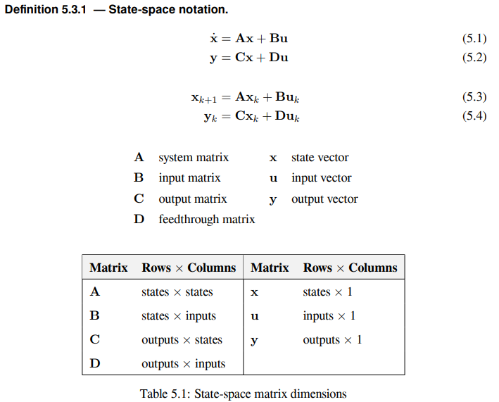

Introduction to state-space control
===================================

.. note:: This article is from `Controls Engineering in FRC <https://file.tavsys.net/control/controls-engineering-in-frc.pdf>`__ by Tyler Veness with permission.
 
From PID to model-based control
-------------------------------

PID controller designers are focused on fiddling with controller parameters relating to the current, past, and future error rather than the underlying system states. While this approach works in a lot of situations, it is an incomplete view of the world.

Model-based control focus on developing an accurate model of the system they are trying to control. These models help inform gains picked for feedback controllers based on the physical responses of the system, rather than an arbitrary porportianl gain derived through testing. This allows us not only to predict ahead of time how a system will react, but also test our controllers without a physical robot and save time debugging simple bugs.

State-space control makes use of linear algebra to generify the math behind state-space control so that it works with any system we might come up with. *TODO link 3b1b intro to linear algebra*

If you've used WPILib's feedforward classes for ``SimpleMotorFeedforward`` or its sister classes, or used FRC-Characterization to pick PID gains foryou, you're already familiar with model-based control! The ``kv`` and ``ka`` gains can be used to describe how a motor (or arm, or drivetrain) will react to voltage. We can put these constants into standard state-space notation using WPILib's ``LinearSystem``, something we will do in a later article.

WPILib's state-space control flow using ``LinearSystemLoop`` follows the following flow:
TODO diagram

Vocabulary
----------

-System: the physical thing being controlled. Has States, Inputs and Outputs associated with it.
-State: A characteristic of a system that can be used to determine the system's future behavior. In state-space notation, the state of a system is written as a column vector decribing it's position in state-space.
    - Ex. A drivetrain system might have the states [x, y, heading]^T to describe it's position on the field.
    - Ex. An elevator system might have the states [position, velocity]^T to describe its current height and velocity.
-Input: any input to the plant (or physical system) that can change the plant's state. Think about inputs as being put *into* the physical system being controlled.
    -Ex. A flywheel will have 1 input: the voltage of the motor driving it.
    -Ex. A drivetrain might have 2 inputs: the voltages of the left and right motors.
-Output: measurements from sensors. Think about this as information coming *out* of the physical system being controlled. There can be more measurements then states. These outputs are used to "correct"
    -Ex. A flywheel might have 1 output from a encoder that measures it's velocity.
    -Ex. A drivetrain might use solvePNP and V-SLAM to find it's x/y/heading position on the field. It's fine that there are 6 measurements (solvePNP x/y/heading and V-SLAM x/y/heading) and 3 states (robot x/y/heading).

What is state-space notation?
-----------------------------

State-space notation is a set of matrix equations which describe how a system will evolve over time. 

