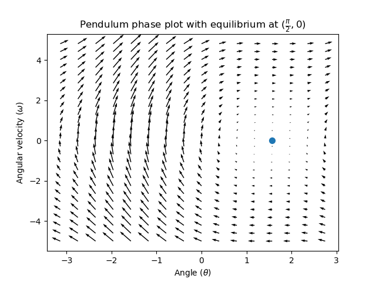

Introduction to state-space control
===================================

.. note:: This article is from `Controls Engineering in FRC <https://file.tavsys.net/control/controls-engineering-in-frc.pdf>`__ by Tyler Veness with permission.
 
From PID to model-based control
-------------------------------

PID controller designers are focused on fiddling with controller parameters relating to the current, past, and future error rather than the underlying system states. While this approach works in a lot of situations, it is an incomplete view of the world.

Model-based control focus on developing an accurate model of the system they are trying to control. These models help inform gains picked for feedback controllers based on the physical responses of the system, rather than an arbitrary proportional gain derived through testing. This allows us not only to predict ahead of time how a system will react, but also test our controllers without a physical robot and save time debugging simple bugs.

..note:: State-space control makes extensive use of linear algebra. More on linear algebra in modern control theory, including an introduction to linear algebra and resources, can be found in Chapter 4 of `Controls Engineering in FRC <https://file.tavsys.net/control/controls-engineering-in-frc.pdf>`__

If you've used WPILib's feedforward classes for ``SimpleMotorFeedforward`` or its sister classes, or used FRC-Characterization to pick PID gains foryou, you're already familiar with model-based control! The ``kv`` and ``ka`` gains can be used to describe how a motor (or arm, or drivetrain) will react to voltage. We can put these constants into standard state-space notation using WPILib's ``LinearSystem``, something we will do in a later article.

Vocabulary
----------

- System: the physical thing being controlled. Has States, Inputs and Outputs associated with it.

- State: A characteristic of a system that can be used to determine the system's future behavior. In state-space notation, the state of a system is written as a column vector describing it's position in state-space.

    - Ex. A drivetrain system might have the states :math:`\begin{bmatrix}x \\ y \\ \theta \end{bmatrix}` [x, y, heading]^T to describe it's position on the field.
    - Ex. An elevator system might have the states [position, velocity]^T to describe its current height and velocity.

- Input: any input to the plant (or physical system) that can change the plant's state. Think about inputs as being put *into* the physical system being controlled.

    - Ex. A flywheel will have 1 input: the voltage of the motor driving it.
    - Ex. A drivetrain might have 2 inputs: the voltages of the left and right motors.

- Output: measurements from sensors. Think about this as information coming *out* of the physical system being controlled. There can be more measurements then states. These outputs are used to "correct"

    - Ex. A flywheel might have 1 output from a encoder that measures it's velocity.
    - Ex. A drivetrain might use solvePNP and V-SLAM to find it's x/y/heading position on the field. It's fine that there are 6 measurements (solvePNP x/y/heading and V-SLAM x/y/heading) and 3 states (robot x/y/heading).

What is state-space?
--------------------

Recall that 2D space has two axes: x and y. We represent locations within this space as a pair of numbers packaged in a vector, and each coordinate is a measure of how far to move along the corresponding axis. State-space is a Cartesian coordinate system with an axis for each state variable, and we represent locations within it the same way we do for 2D space: with a list of numbers in a vector. Each element in the vector corresponds to a state of the system. This example shows two example state vectors in the state-space of an elevator model with the states :math`[\text{position}, \text{velocity}]`

.. image:: images/state-space-graph.png

In this image, the vectors representing states in state-space are arrows. From now on these vectors will be represented simply by a point at the vector's tip, but remember that the rest of the vector is still there.

In addition to the state, inputs and outputs are represented as vectors. Since the mapping from the current states and inputs to the change in state is a system of equations, it’s natural to write it in matrix form. This matrix equation can be written in state-space notation.

What is state-space notation?
-----------------------------

State-space notation is a set of matrix equations which describe how a system will evolve over time. These equations relate the change in state :math:`\dot{\mathbf{x}}`, and the output :math:`\mathbf{y}`, to linear combinations of the current state vector :math:`\mathbf{x}` and input vector :math:`\mathbf{u}`. See section 4.2 of `Controls Engineering in FRC <https://file.tavsys.net/control/controls-engineering-in-frc.pdf>`__ for an introduction to linear combinations. The core idea of linear transformations is that we are simply summing or scaling the elements of :math:`\mathbf{x}` and :math:`\mathbf{u}`. For example, an operation involving an exponent or trigonometric function would not be considered a linear transformation. The following two sets of equations are the standard form of continuous and discrete state-space notation:

.. math::
    \text{Continuos:}
    \dot{\mathbf{x}} &= \mathbf{A}\mathbf{x} + \mathbf{B}\mathbf{u} \\
    \mathbf{y} &= \mathbf{C}\mathbf{x} + \mathbf{D}\mathbf{u} \\
    \nonumber \\
    \text{Discrete:}
    \mathbf{x}_{k+1} &= \mathbf{A}\mathbf{x}_k + \mathbf{B}\mathbf{u}_k \\
    \mathbf{y}_k &= \mathbf{C}\mathbf{x}_k + \mathbf{D}\mathbf{u}_k

.. .. math::
..   \begin{figurekey}
..     \begin{tabular}{llll}
..       $\mtx{A}$ & system matrix, states \times states       & $\mtx{x}$ & state vector, states \times 1 \\
..       $\mtx{B}$ & input matrix, states \times inputs        & $\mtx{u}$ & input vector, inptus \times 1 \\
..       $\mtx{C}$ & output matrix, outputs \times states      & $\mtx{y}$ & output vector, outputs \times 1 \\
..       $\mtx{D}$ & feedthrough matrix, outputs \times inputs &  
..     \end{tabular}
..   \end{figurekey}

State-space control can deal with "continuous" or "discrete" systems. In decades past, plants and controllers were implemented using analog electronics, which are continuous in nature. These analog controllers didn't have discrete steps to them, analogous to an infinitely fast computer processor. However, processors such as the RoboRIO run in discrete "steps." Systems are often modeled first as continuous systems, and later converted to the discrete form in a process called discretization. WPILib's LinearSystem takes the continuous system matrices, and converts them internally where necessary. 

..note:: Since a microcontroller performs discrete steps, there is a sample delay that introduces phase loss in the controller. Large amounts of phase loss can make a stable controller in the continuous domain become unstable in the discrete domain. The easiest way to combat phase loss and increase performance is to decrease the time between updates. WPILib's ``Notifier`` class can be used if updates faster than the main robot loop are desired. 

State-space notation example -- Flywheel from kV and kA
~~~~~~~~~~~~~~~~~~~~~~~~~~~~~~~~~~~~~~~~~~~~~~~~~~~~~~~

Recall that we can model the motion of a flywheel connected to a brushed DC motor with the equation :math:`V = kV \dot v + kA \dot a`, where V is voltage output, v is the flywheel's angular velocity and a is its angular acceleration. This equation can be rewritten as :math:`a = (V - kV \dot v) / kA`, or :math:`a = ((-kV / kA) \dot v + 1/kA \dot V)`. Notice anything familiar? This equation relates the angular acceleration of the flywheel to its angular velocity and the voltage applied. 

We can convert this equation to state-space notation. We can create a system with one state (velocity), one input (voltage), and one output (velocity). Recalling that the first derivative of velocity is acceleration, we can write our equation as follows:

.. math:: 
    \mathbf{\dot{x}} &= [\frac{-kV}{kA}] \cdot v + \frac{1}{kA} \cdot V

That's it! That's the state-space model of a system for which we have the kV and kA constants. This same math is use in FRC-Characterization to model flywheels and drivetrain velocity systems.

Visualizing State-space responses: phase portrait
-------------------------------------------------

A `phase portrait <https://en.wikipedia.org/wiki/Phase_portrait>`__ can help give a visual intuition for the response of a system in state-space. The vectors on the graph have their roots at some point :math:`\mathbf{x}` in state-space, and point in the direction of :math:`\mathbf{\dot{x}}`, the direction that the system will evolve over time. This example shows a model of a pendulum with the states of angle and angular velocity. 

.. .. raw:: html

..     

..     <iframe width="100%" height="350" src="https://raw.githubusercontent.com/mcm001/state-space-animations/master/videos/phase-space/720p30/PendulumCirclingOrigin.mp4" frameborder="0" allow="autoplay; encrypted-media" allowfullscreen></iframe>
..     

To trace a potential trajectory that a system could take through state-space, choose a point to start at and follow the arrows around. In this example, we might start at :math:`[-2, 0]`. From there, the velocity increases as we swing through vertical and starts to decrease until we reach the opposite extreme of the swing. This cycle of spinning about the origin repeats indefinitely.

Note that near the edges of the phase plot, the X axis wraps around as a rotation of :math:`\pi` radians counter clockwise and a rotation of :math:`\pi` radians clockwise will end at the same point.

For more on differential equations and phase portraits, see `3Blue1Brown's Differential Equations video <https://www.youtube.com/watch?v=p_di4Zn4wz4>`__ -- they do a great job of animating the pendulum phase space at around 15:30.

Visualizing Feedforward
~~~~~~~~~~~~~~~~~~~~~~~

This phase portrait shows the "open loop" responses of the system -- that is, how it will react if we were to let the state evolve naturally. If we want to, say, balance the pendulum horizontal (at :math:`(\frac{\pi}{2}, 0)` in state space), we would need to somehow apply a control input to counteract the open loop tendency of the pendulum to swing downward. This is what feedforward is trying to do -- make it so that our phase portrait will have an equilibrium at the reference position (or setpoint) in state-space. Looking at our phase portrait from before, we can see that at :math:`(\frac{\pi}{2}, 0)` in state space, gravity is pulling the pendulum down with some torque T, and producing some downward angular acceleration with magnitude :math:`\frac{\tau}{i}`, where I is angular `moment of inertia <https://en.wikipedia.org/wiki/Moment_of_inertia>`__ of the pendulum. If we want to create an equilibrium at our reference of :math:`(\frac{\pi}{2}, 0)`, we would need to apply an input that produces a :math:`\mathbf{\dot{x}}` is equal in magnitude and opposite in direction to the :math:`\mathbf{\dot{x}}` produced by the system's open-loop response to due to gravity. The math for this will be presented later. Here is the phase portrait where we apply a constant input that opposes the force of gravity at :math:`(\frac{\pi}{2}, 0)`:

Feedback Control and LQR
------------------------

In the case of a DC motor, with just a mathematical model and knowledge of all current states of the system(i.e., angular velocity), we can predict all future states given the future voltage inputs. But if the system is disturbed in any way that isn’t modeled by our equations, like a load or unexpected friction,the angular velocity of the motor will deviate from the model over time. To combat this, we can give the motor corrective commands to account for model uncertainty. 

A PID controller is a form of feedback control. State-space control often uses the control law (a mathematical formula that generates inputs to drive a system to a desired state) :math:`\mathbf{u} = \mathbf{K(r - x)}`, where K is some controller gain matrix, r is the reference state and x is the current state in state-space. The difference between these two vectors, :math:`r - x`, is known as "error." This control law is essentially a multidimensional proportional controller. Because model-based control means that we can predict the future states of a system given an initial condition and future control inputs, we can pick a mathematically optimal gain matrix K. 

Let's start with the open loop pendulum example. The case where K is the zero matrix would mean that no control input is applied, and the phase portrait would look identical to the one above. Let's pick a K of [[2, 0], [0, 2]], where are input to the pendulum is angular acceleration. This K would mean that for every degree of position error, the angular acceleration would be 1 degree per second squared; similarly, we accelerate by 1 degree per second squared for every degree per second of error. Try following an arrow from somewhere in state-space inwards -- no matter the initial conditions, the state will settle at the reference rather than circle endlessly with pure feedforward. 

But with a real system, how can we choose an optimal gain matrix K?
L I N E A R Q U A D R A T I C R E G U L A T O R

WPILib's LinearSystemLoop
-------------------------

WPILib's state-space control is based on the ``LinearSystemLoop`` class. This class contains all the components needed to control a mechanism using state-space control. It contains the following members:

- A ``LinearSystem`` representing the continuous state-space equations of the system.
- A Kalman Filter, used to filter noise from sensor measurements.
- A Linear Quadratic Regulator, which combines feedback and feedforward to generate inputs.

As the system being controlled is in discrete domain, we follow the following steps at each update cycle:

- ``correct(measurement, nextReference)`` "fuses" the measurement and Kalman Filter :math:`\dot{\mathbf{x}}` to update the filter's estimate :math:`\dot{\mathbf{x}}`. This updated state estimate is used by the Linear Quadratic Regulator to generate an updated input :math`\mathbf{u}` to drive the system towards the next reference (or setpoint).

- ``predict()`` is called to update the Kalman Filter's state vector estimate :math:`\dot{\mathbf{x}}` based on applied inputs.

- The updated input is set to motors or other physical actuator.

