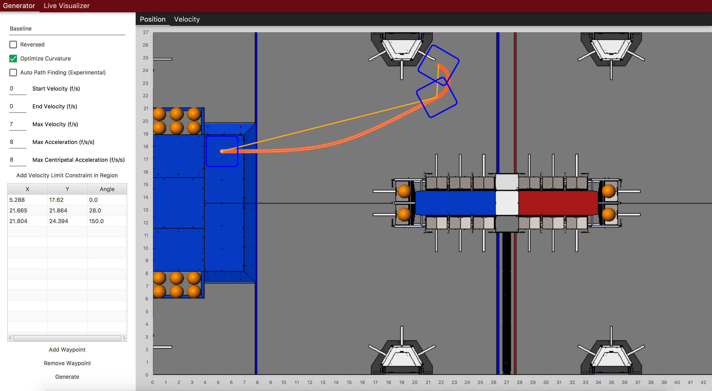
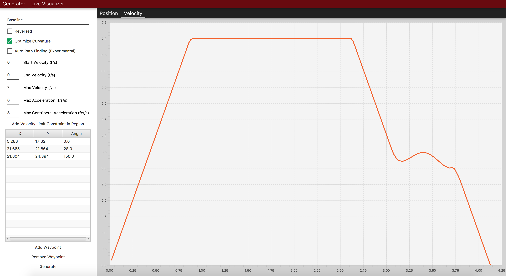
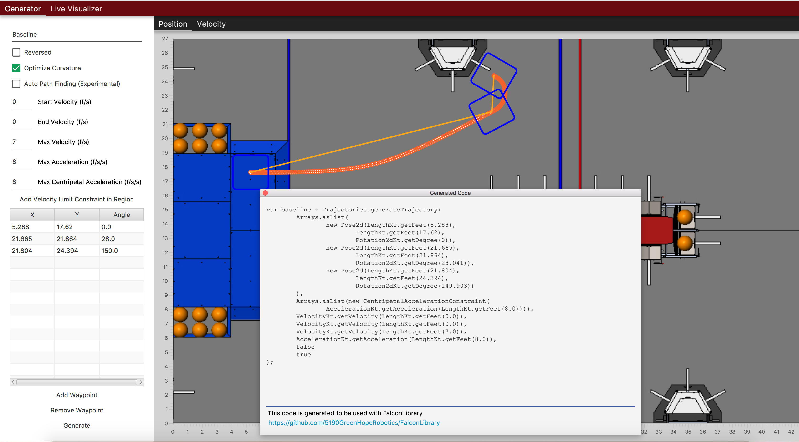

FalconDashboard
================

Falcon Dashboard is a Kotlin-based utility that can be used to generate
trajectories and visualize the robot's position on the field live. This
utility uses FalconLibrary as the backend trajectory generation code,
and generates code that can be pasted into your robot code. The source
code is publically avalible at https://github.com/5190GreenHopeRobotics/FalconDashboard

Running the dashboard
----------------------

Clone or download the repository, and execute this command from within
the project root directory: 

    ./gradlew run 

Generating code
-----------------

To generate code, just click generate and paste the code into
a command or command group. Specific implementation will vary
user to user. See Following Trajectories (TODO Link) for more
information.

